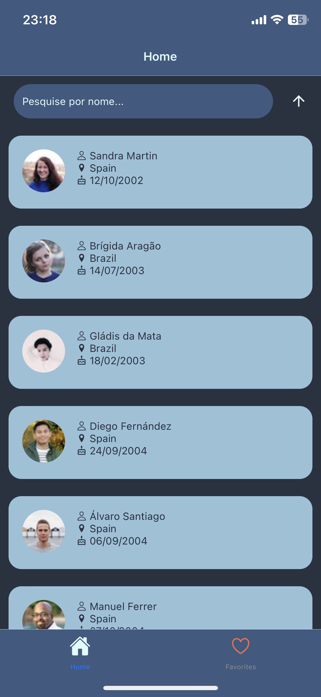
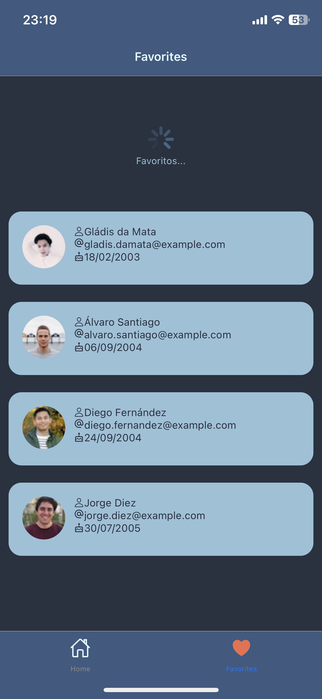
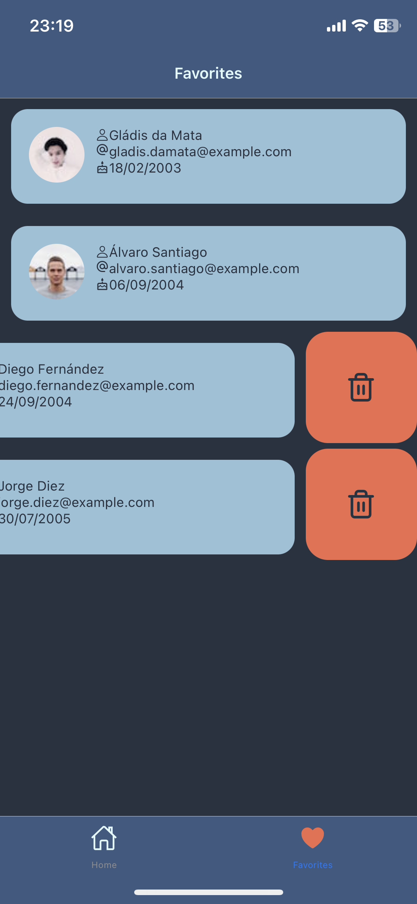
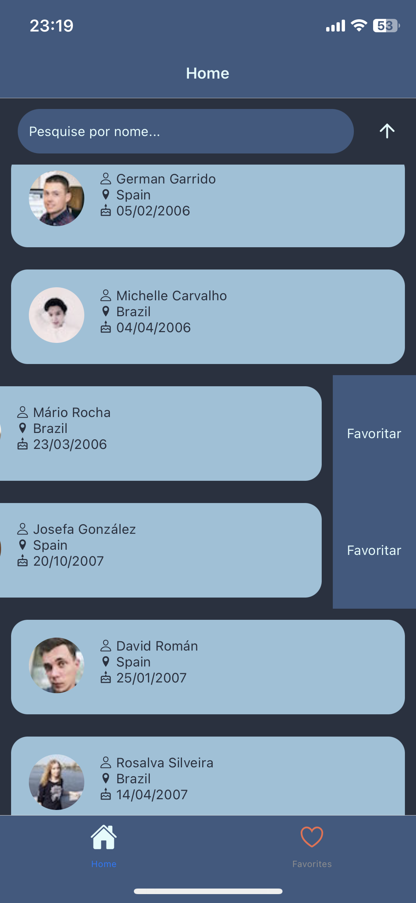

# Pharma Inc

## Finalidade

App de vizualição de clientes, com mecanismo de busca por nome, visualização de detalhes do cliente e favoritação

## ScreenShot & Video

demo: https://photos.app.goo.gl/Fi3VgfgRZG9r1kFfA







## ferramentas Utilizadas

- **React Native**
- **Expo**
- **Babel**
- **TypeScript**
- **Node**
- **API**
- **Yarn**
- **etc...**

## Get Started

Baixe o **Node** ou tenha o **Yarn**
E NÃO SE ESQUEÇA DE INSTALAR O EXPO-CLI

2. instale:

```bash
  npm i --force
```
### ou

```bash
  yarn install
```


## Como usar
Baixe um emulador ou tenha um SmartPhone android ou iOS:

```bash
npx react-native run-android  # para Android e ler o qr code

ou

npx react-native run-ios  # para iOS e ler o qr code

ou

expo start # para expo e ler o qr code

ou

yarn start # para expo e ler o qr code

```
## Caso não suporte typescript

```bash
yarn add -D @types/react @types/react-native

```

# Build with ❤️